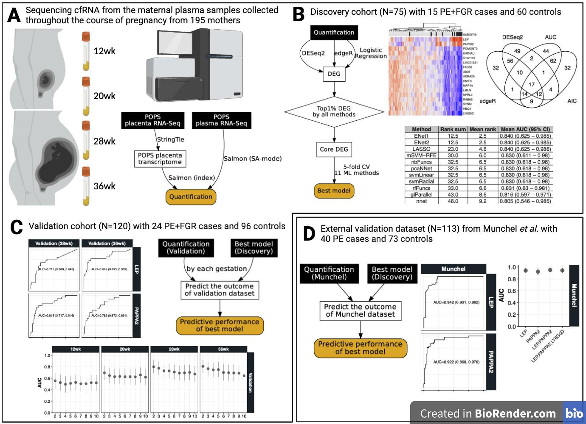

[!Quarto Publish](https://github.com/ObsGynaeCam/cell-free-rna-2024/actions/workflows/publish.yml/badge.svg)(https://github.com/ObsGynaeCam/cell-free-rna-2024/actions/workflows/publish.yml)

This repo is to supplement the manuscript "Elevated levels of circulating Leptin (LEP) and Pappalysin2 (PAPPA2) cell-free RNAs are the hallmarks of pregnancies complicated by preeclampsia combined with fetal growth restriction" by Gong _et al._ submitted to Science Translation Medicine.

## Abstract

Preeclampsia (PE) and fetal growth restriction (FGR) complicate 5-10% of pregnancies and are major causes of maternal and fetal morbidity and mortality. Sequencing of fetus or placenta-derived cell-free DNA (cfDNA) in maternal plasma is now clinically established and it is far more predictive for fetal aneuploidy than combined ultrasonic and biochemical screening. However, the potential for screening for PE and FGR using cell-free RNA (cfRNA) is relatively unexplored. Here we demonstrate that measuring circulating cfRNAs from maternal plasma can accurately predict pregnancies complicated by the combination of PE and FGR. We investigated a total of 751 maternal plasma samples drawn at four gestational ages (12, 20, 28 and 36 weeks) from 195 pregnant women (39 cases; 156 non-cases) and measured the abundance of cfRNAs using a next-generation sequencing platform. We developed a number of machine learning models from our discovery cohort (15 cases; 60 non-cases) and evaluated their predictive performances internally (24 cases; 96 controls) and externally (40 cases; 73 non-cases). We found circulating leptin (LEP) and pappalysin2 (PAPPA2) mRNAs are the two strongest cfRNA predictors of complicated pregnancies, each with an area under the receiver operating characteristic curve (AUC) of ~0.82 in our internal validation dataset. Using the external validation dataset of women with established PE, LEP and PAPPA2 had AUCs of 0.943 and 0.922, respectively, and a combined model had an AUC ~0.951. Our findings open a new window of liquid biopsy by using cfRNAs for monitoring complications of human pregnancy.

{#fig-study-design}
